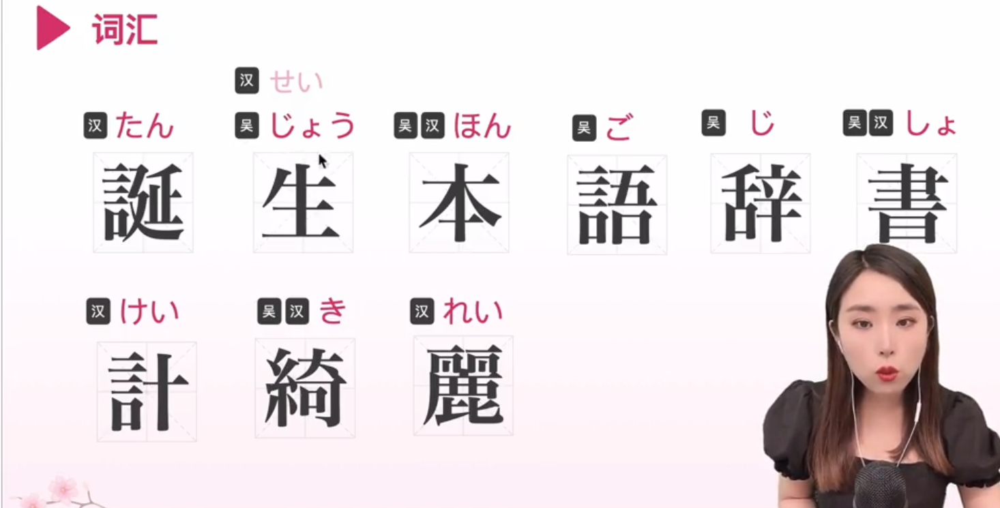
 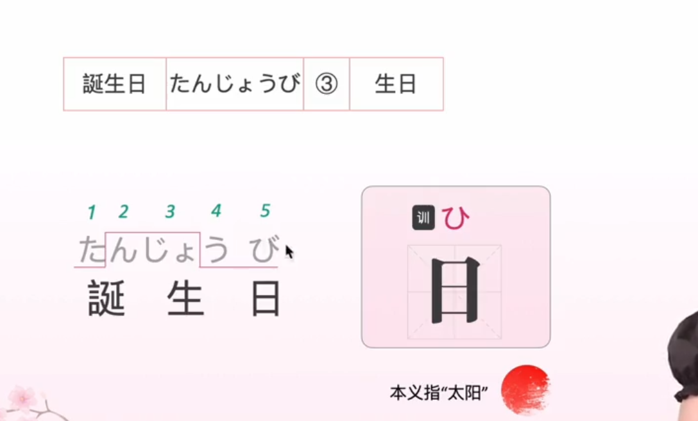
 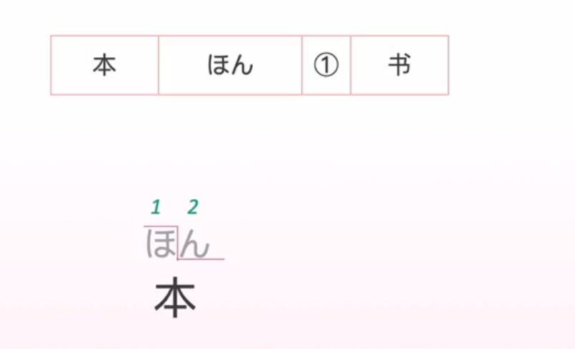
 这两个名词之间使用no粘在一起，不然就不是一个句子了，而是单独的两个词了
 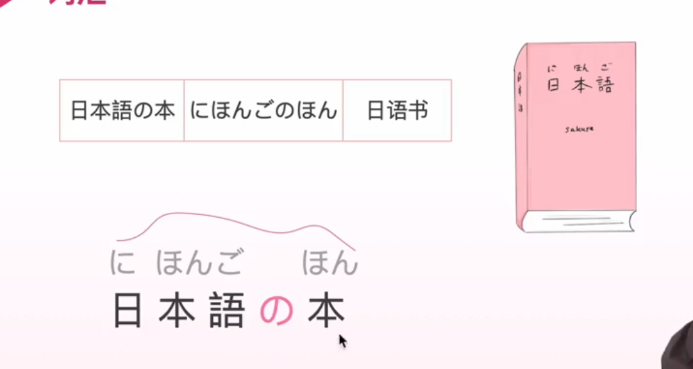

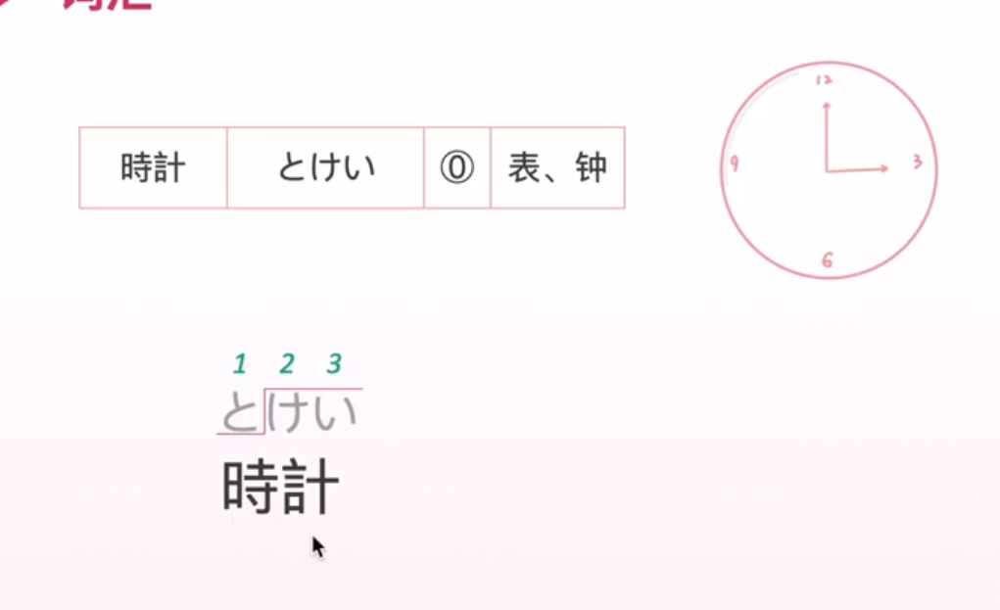

整体意思是手表。
这个wu，原本就有向上的意思，然后te是手的意思。那么二者连起来表示手的上部分，那就自然包括手腕啦。所以不要知识以为它表示手腕。
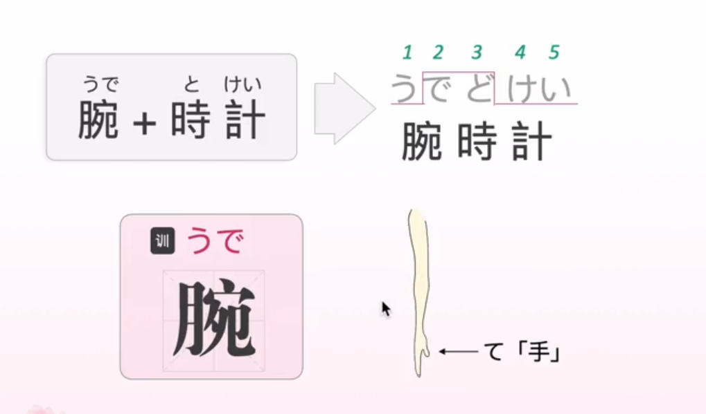

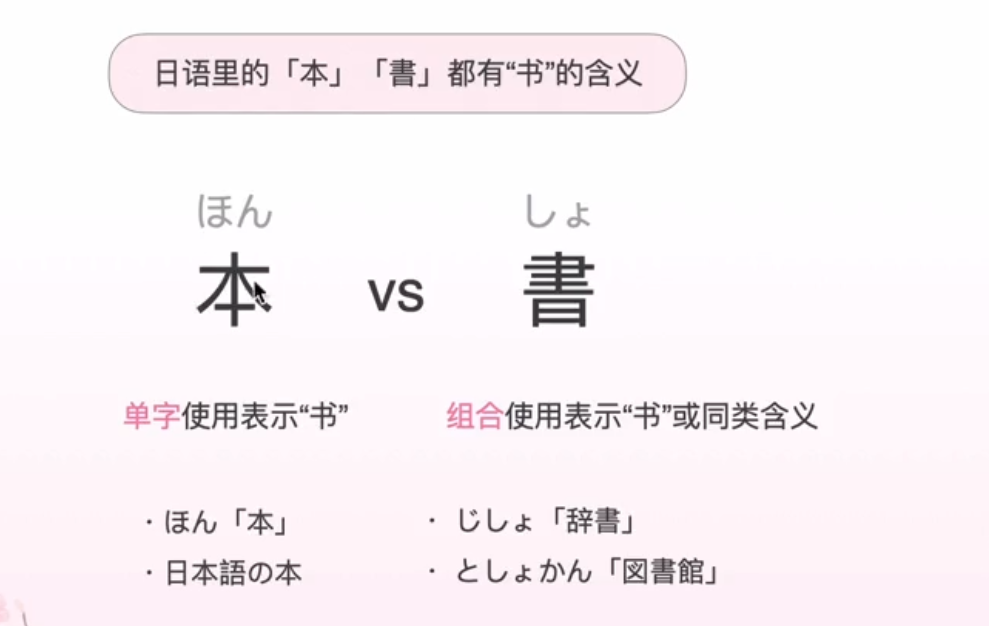
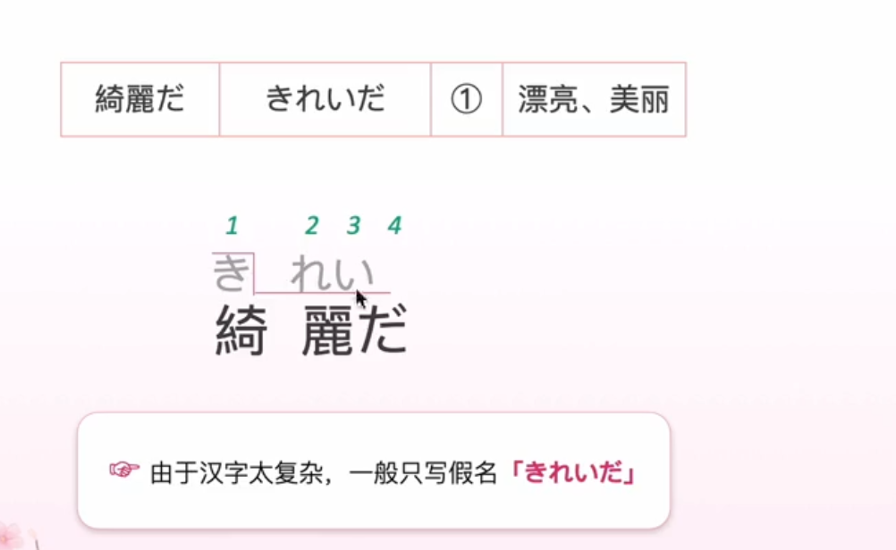

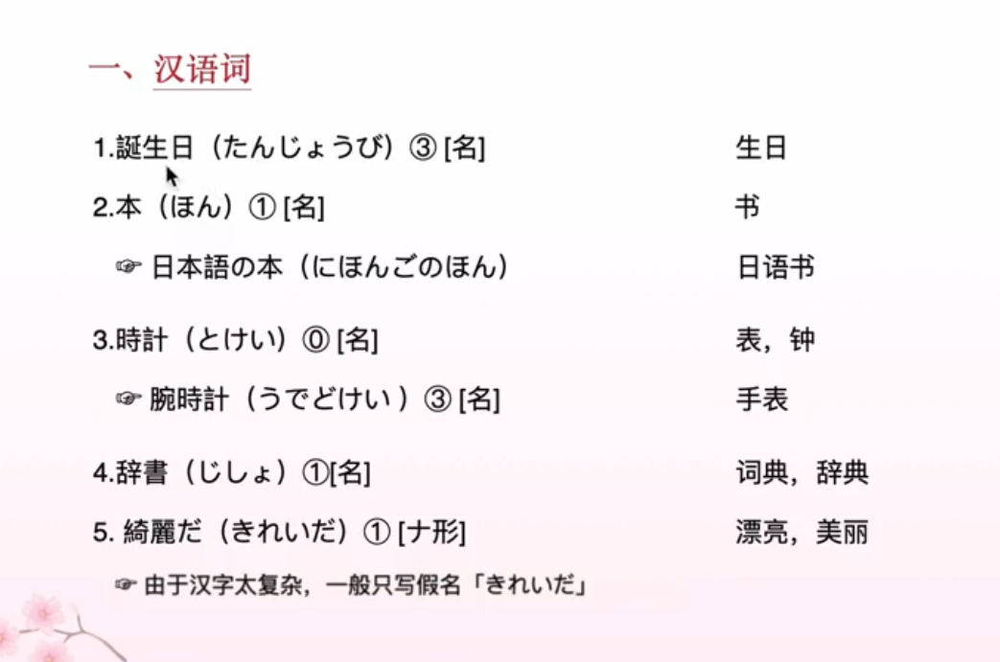
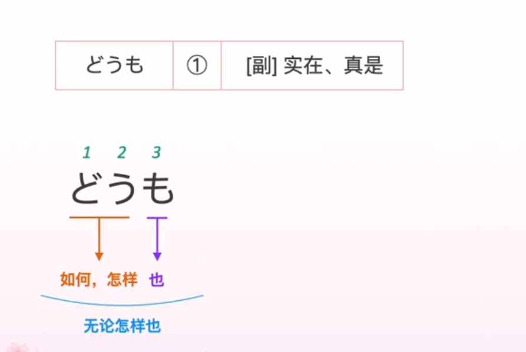

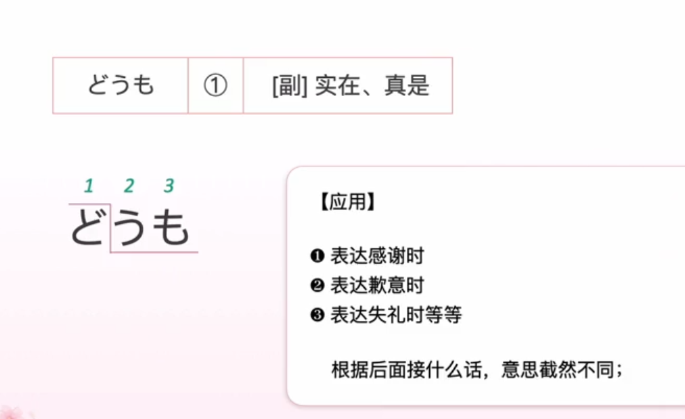
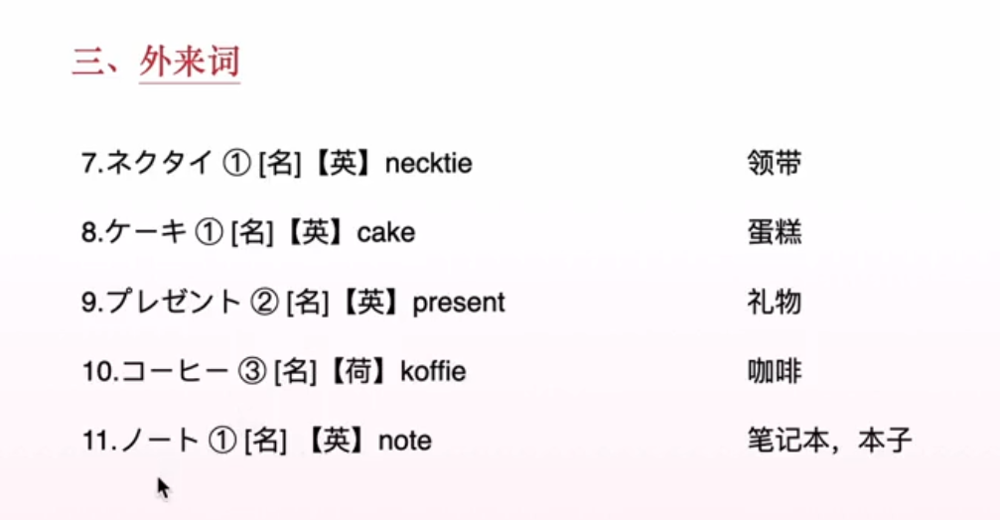

荷兰传过来的，是日本当时唯一的交往的欧洲国家
 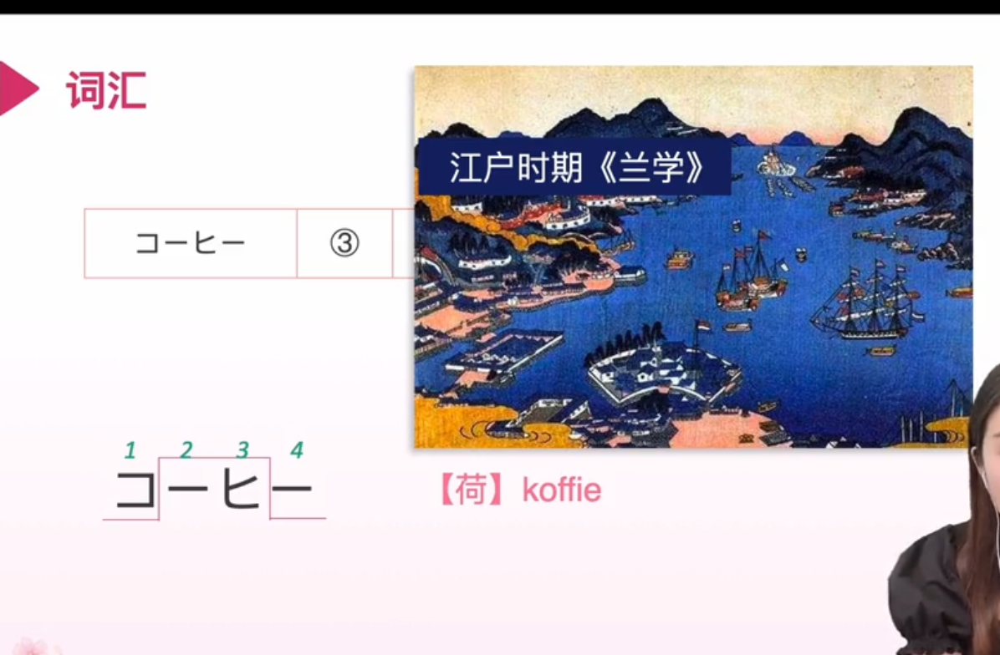
 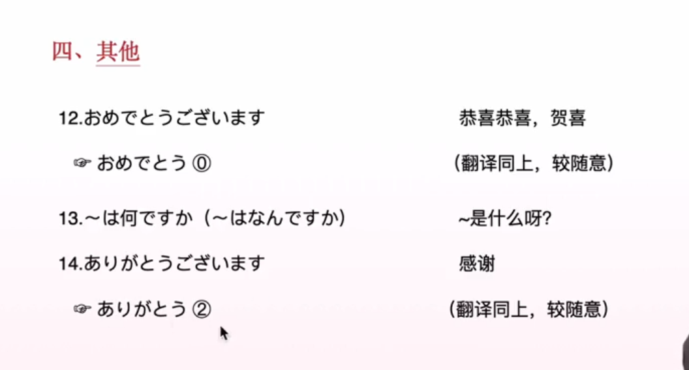
 出自于欣赏这个词语，“あでる"，"あ"是敬语用法，其中"あ"表示眼睛，而 "でる"表示出来。也就是让人眼睛放光的感觉，就是欣赏的意思了。然后引用一部分用法就当做了恭喜，祝贺的意思
 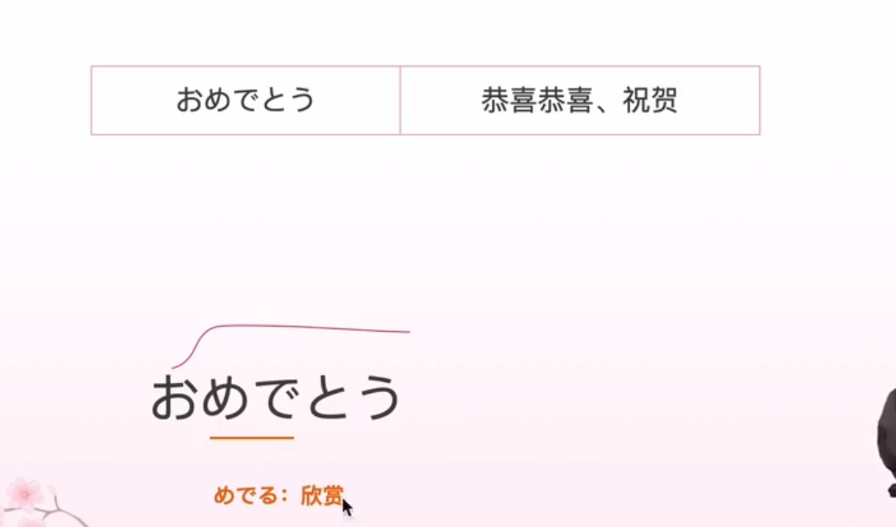
"は"在这里是一个主语助词，黏在后面的胶水，所以读作wa。加上主语之后这里的意思就是：礼物是什么呀
 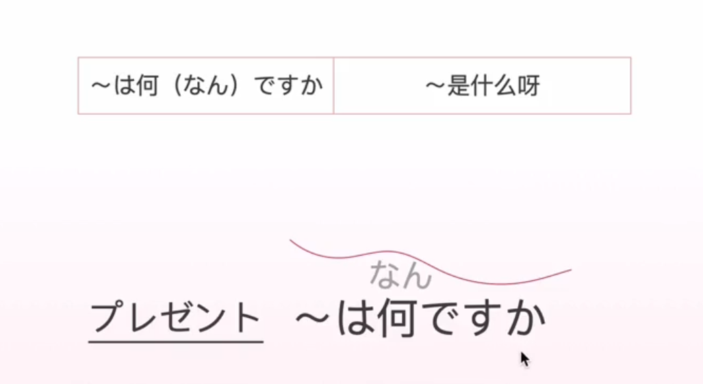
 难得的--》感谢
 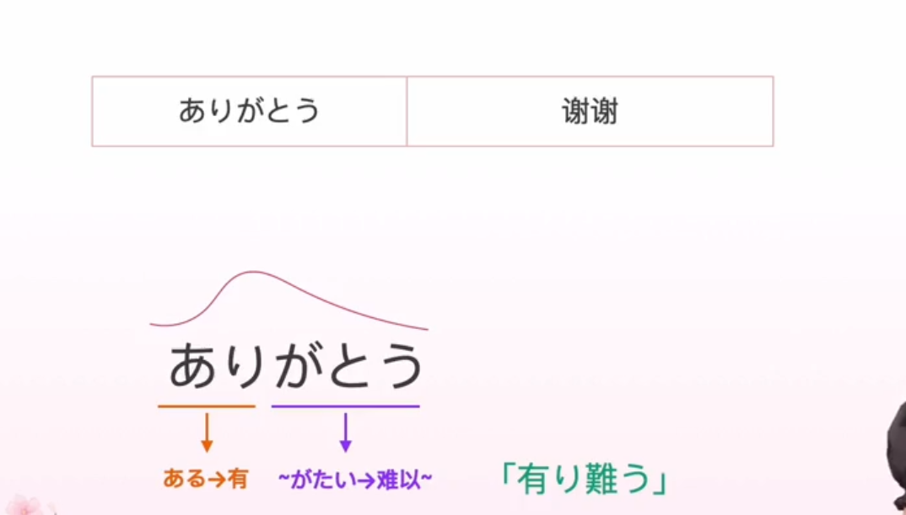