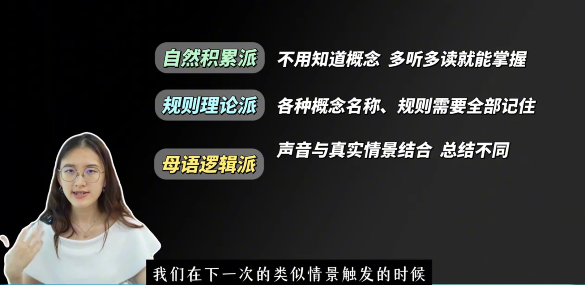
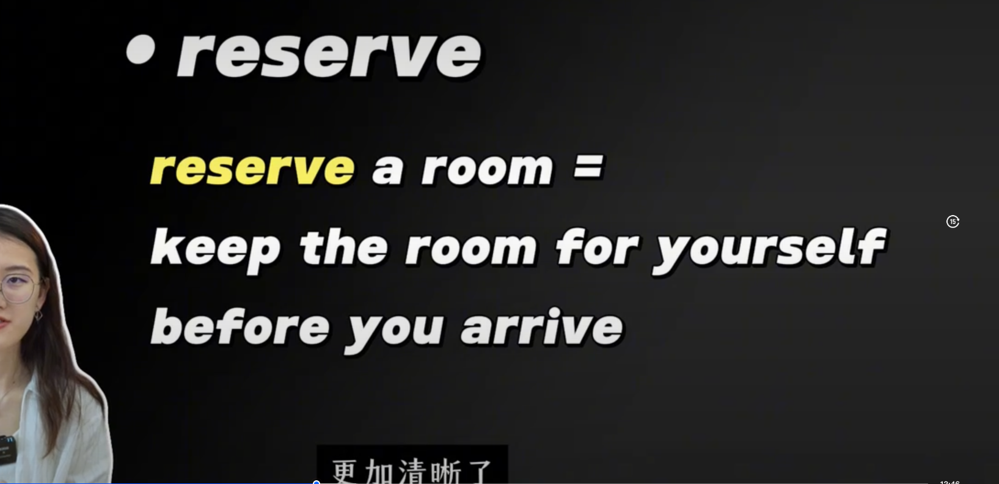
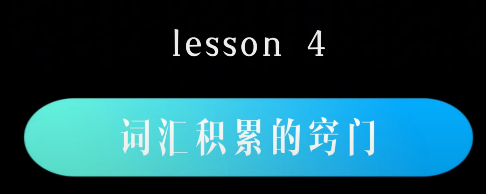
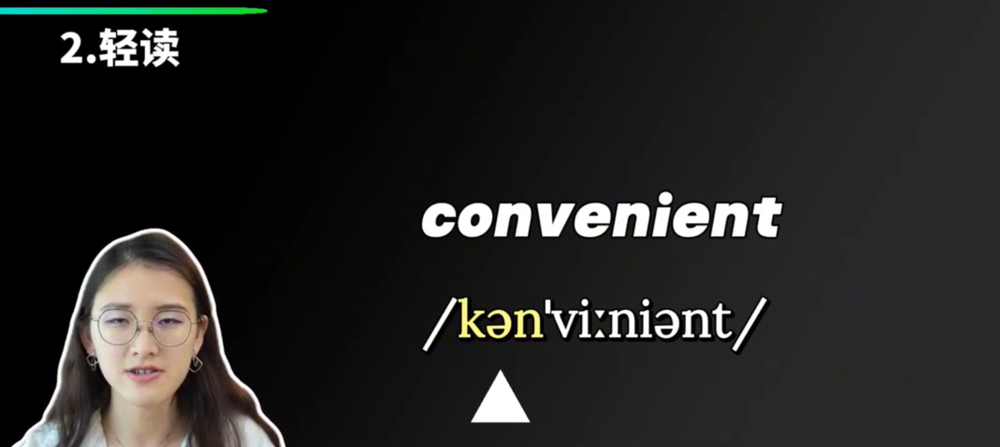

听声音不可以跳过，必须要训练对于词汇声音熟悉度，记忆自然拼读不要放太多精力，应该做的就是多听。多的不准确就会影响听力。声音期待这个术语就会影响听力。
- 要多听词汇声音，正确的说出来
- 句子的量要多积累，发音

搜索引擎搜索这些单词，然后重点观察这个词语的画面，听声音。把声音和画面结合起来。
- 大部分词汇，是比较抽象的。读词语的英文解释，慢慢过渡到全部英文的解释，这种方式培养自己英文思维的能力。不借助英文翻译。
- 少部分词汇，画面理解

如何选择英文词典：

- 1。主次分别
- 2，举一反三
主动输出更加容易记住，模仿句子然后造句。少量多次

 

I'm about to

不要记忆规则，注意嘴形和嘴部肌肉的动作才是王道。

