听力素材选择
需求：
- 美剧和电影，和生活紧密连接的影视剧。生活大爆炸，摩登家庭，好运查理，老友记7-8季开始更合适，不然和当前生活脱离太多。怦然心动，爱乐之城，
- ted演讲，名人演讲 适合职场。演讲素材。why the best hire might not have the perfect resume.steve jobs演讲。stay hungrey,stay foolish
- 纪录片 planet earth，TED Ed 科普小视频，

喜好：
喜剧，笑话之类的视频

素材标准：
连蒙带猜，才出剧情走向和人物关系。对于演讲要可以听得懂大部分意思。小猪佩奇动画片也可以看。

1.范听：
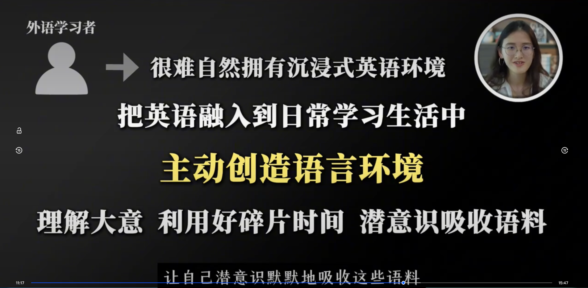
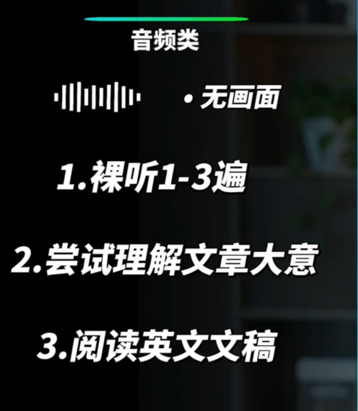
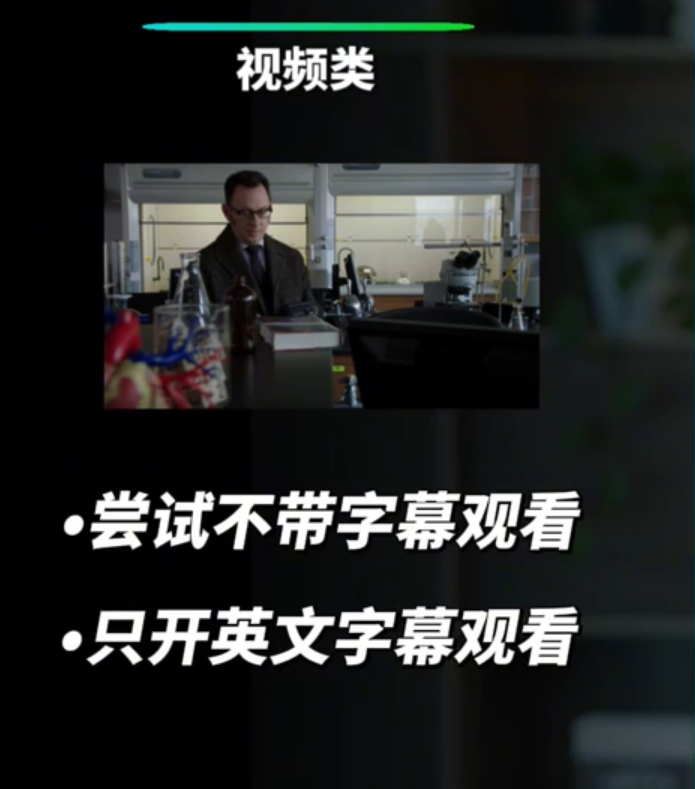
2.精听：
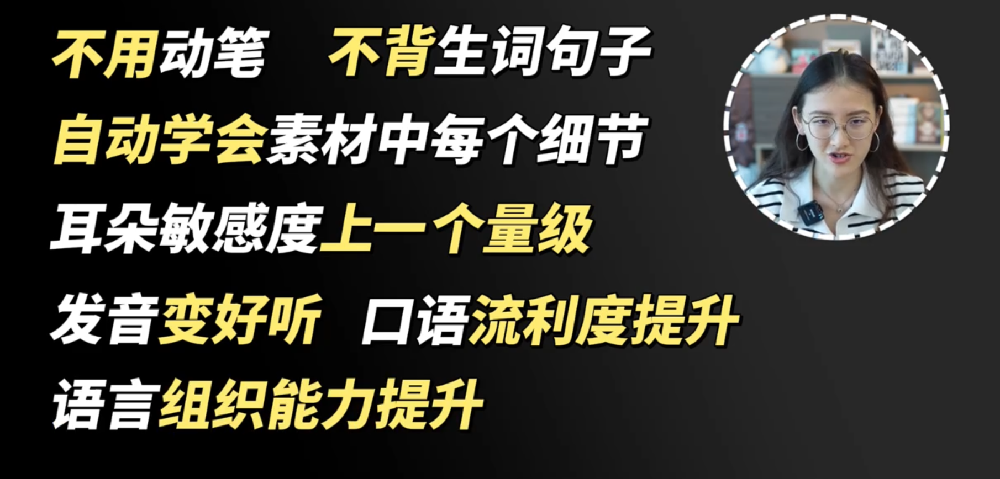
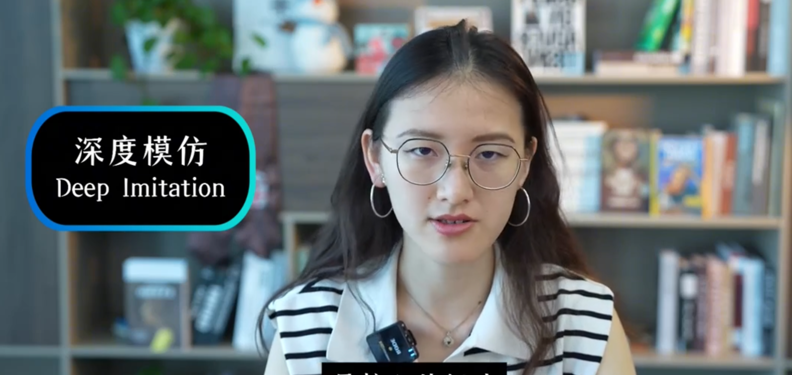
深度模仿，不在多，而在细
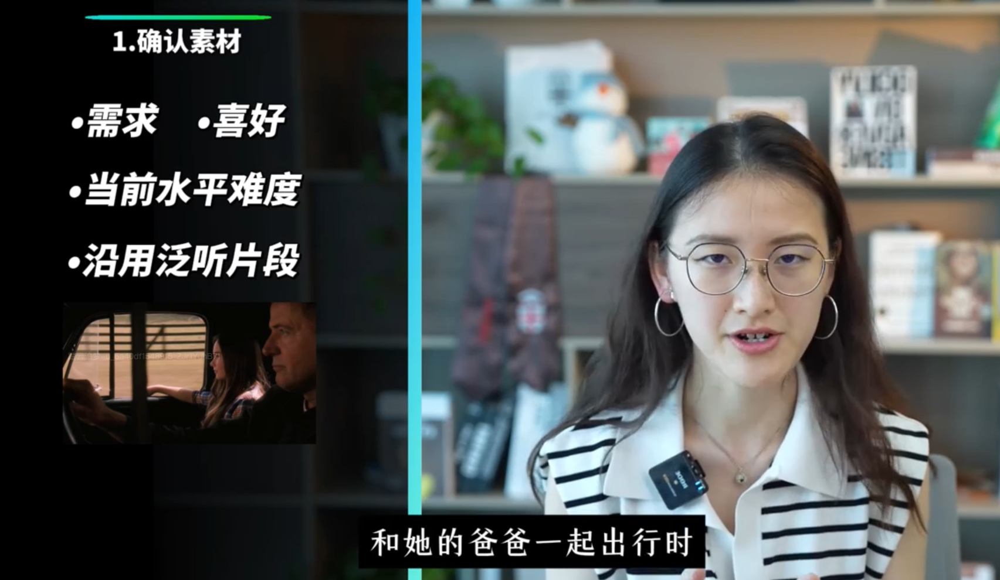
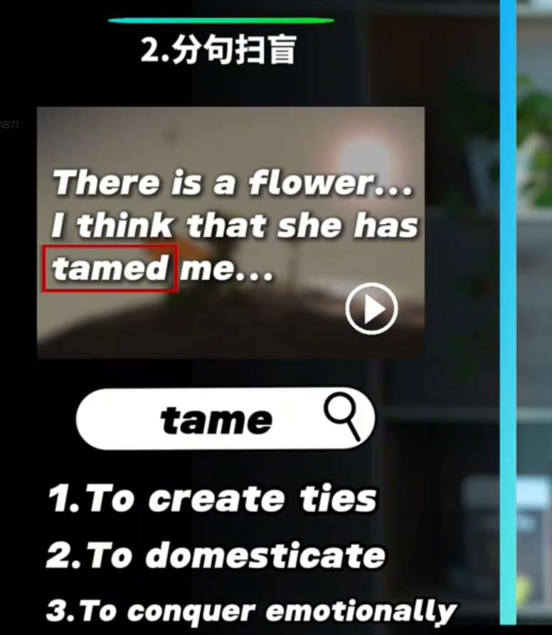
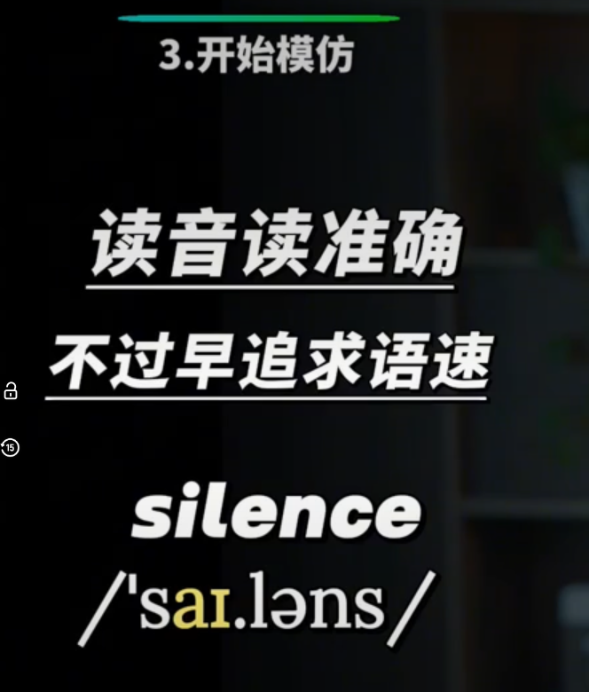
不要只是跟读，要主动模仿。
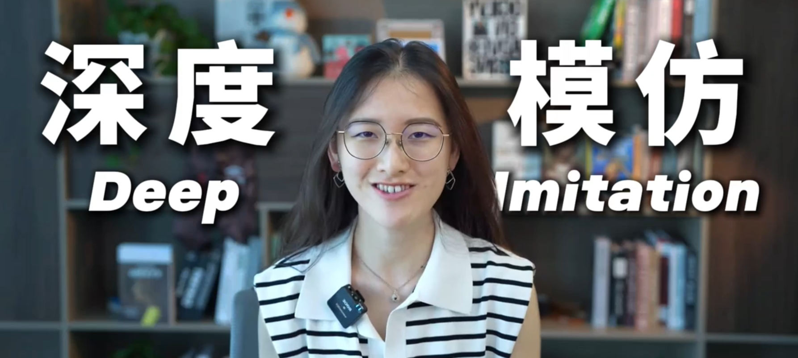
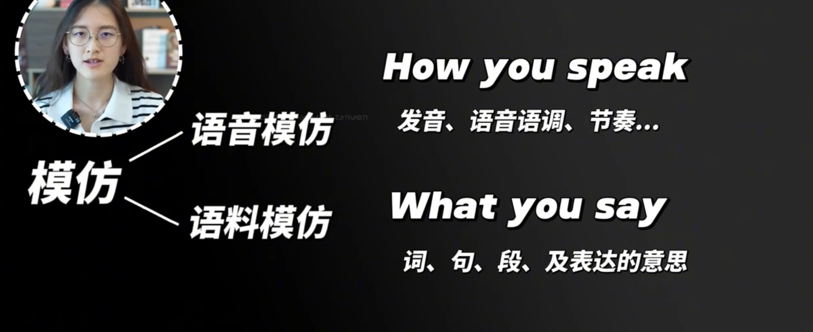

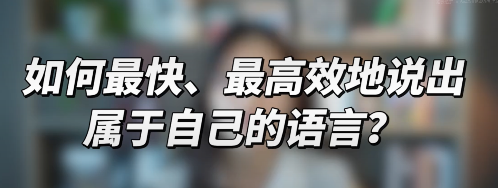
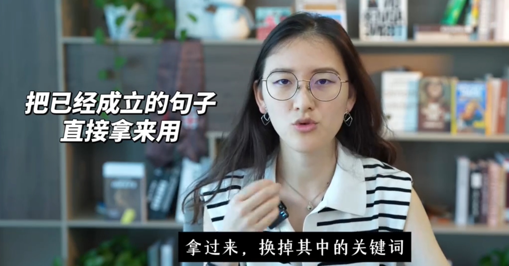
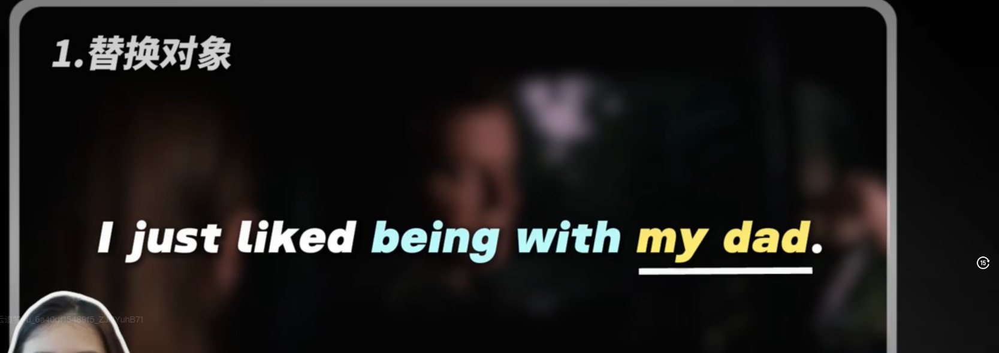
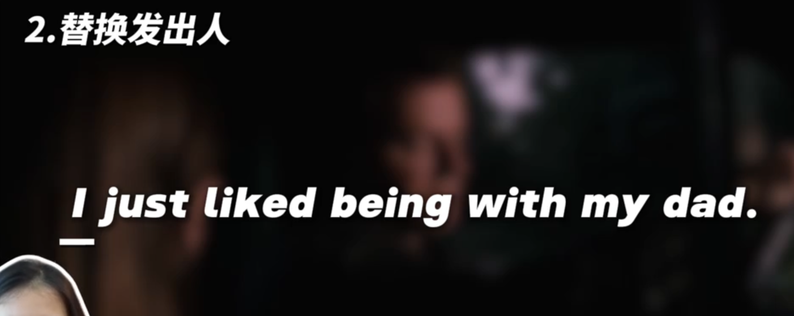
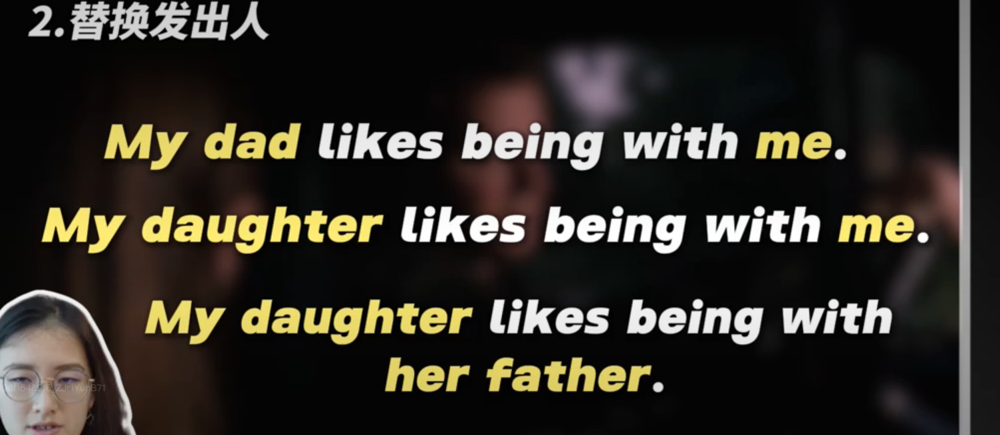
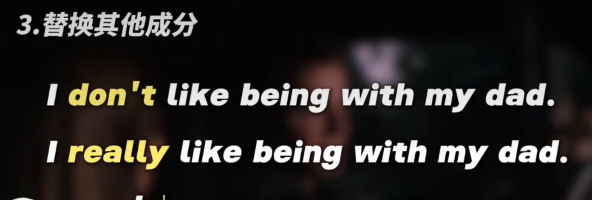
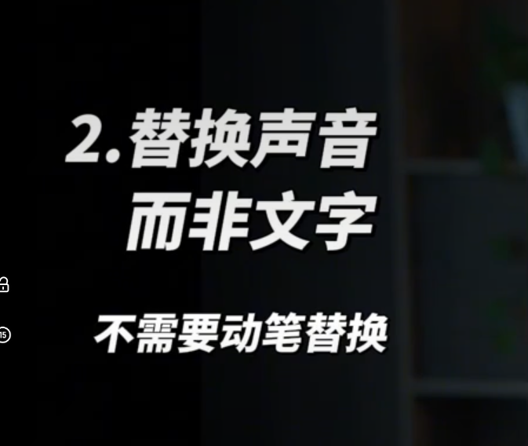

